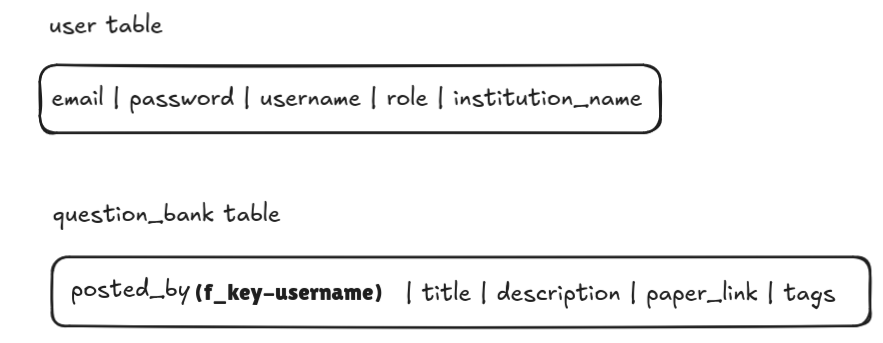

Question papers are available to anyone. Thus no auth needed. But there needs to be a account creation option because a user needs to save and post question papers.
So sign up and sign in will be necessary.

Database schema overview after this correction:
- a user table containing auth credentials and the basic details
- a question bank table where the columns would be title, description, question papers(static storage), tags(help in search queries), uploaded_by(one to many relationship with user table), 

